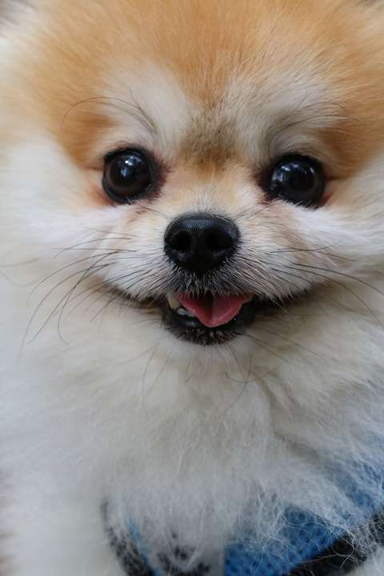
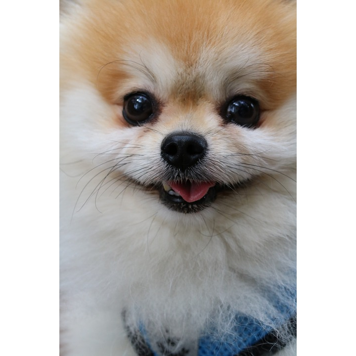
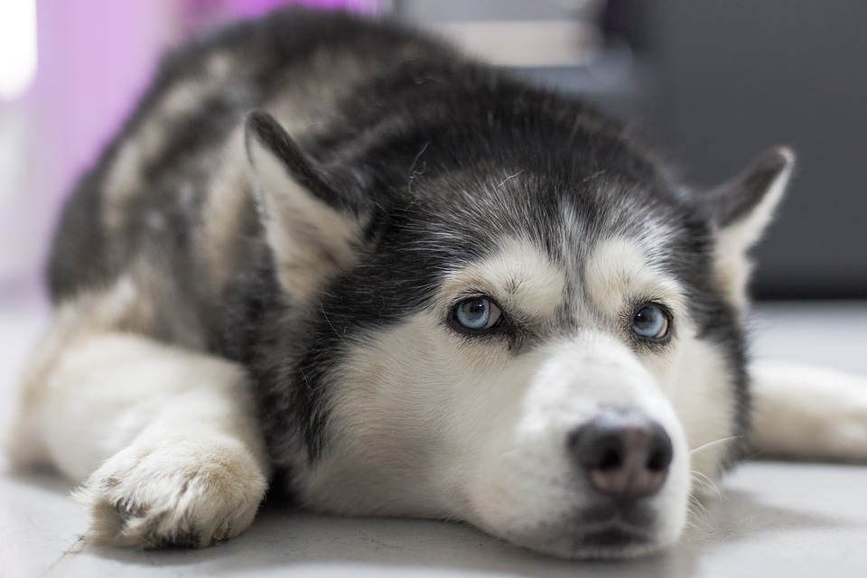
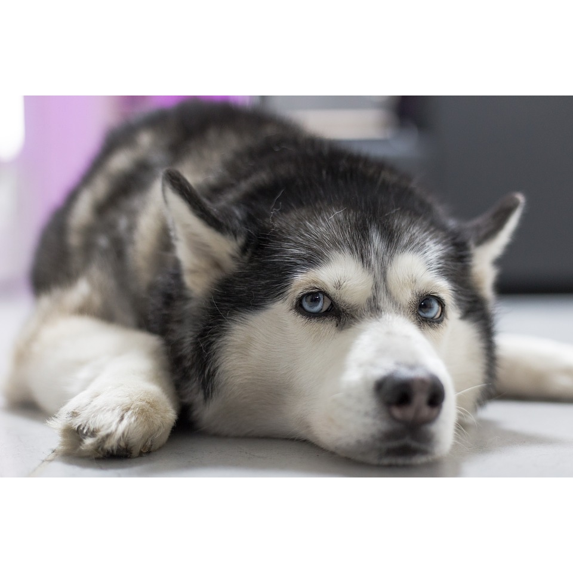

# Square-App-Utility
**A plugin for bulk image processing. This utility helps to resize and square the images. Below are a few examples.**

   

## Original vs Modified
<kbd></kbd>&nbsp;&nbsp;&nbsp;&nbsp;&nbsp;&nbsp;&nbsp;&nbsp;<kbd></kbd>

   

## Original vs Modified
<kbd></kbd>&nbsp;&nbsp;&nbsp;&nbsp;&nbsp;&nbsp;&nbsp;&nbsp;<kbd></kbd>
